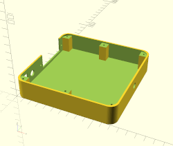
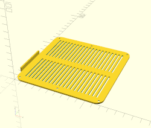
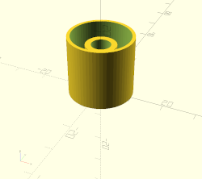
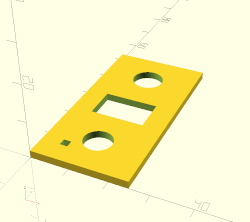

Customizable Bluetooth amplifier box - CAD model
================================================

### Overview






### Required hardware 
- Bluetooth amplifier module [AliExpress](https://pt.aliexpress.com/item/32944600683.html);
- Power button [AliExpress](https://pt.aliexpress.com/item/1000005699023.html);
- Speaker connector [AliExpress](https://pt.aliexpress.com/item/4001218884478.html);
- DC connector [AliExpress](https://pt.aliexpress.com/item/32694504978.html);
- Power adapter (12-15V, 2A);

### Dependencies
 - "OpenSCAD Screw Holes", by Carlo Wood, License: CC SA (included) 

### Instructions

1. Edit tunables in amplifier_box.scad  for required dimensions & component sizes;
2. Either use available flags in amplififer_box.scad to render each part or use the makefile to render all the different
parts to the stl/ folder:
```shell
$ make
```

### Notes

- While the design is parametric, it was only tested with the default dimensions (125x125x25, 2mm wall);
- The lid may require a bit of grinding after printing, due to 3d print tolerances;
- You can safely ignore the compiler warnings about len() regarding the screw library;
